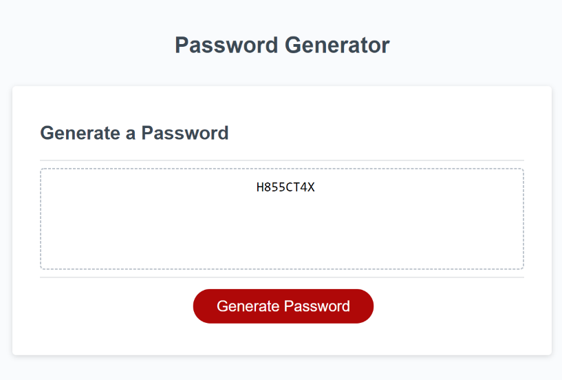

# Generate a Random Password

## About the Project

&nbsp;

I was provided the HTML and CSS files' code for this project. My task was to create javascript code that would allow a user to pick the criteria they would like to include in their random password. I was provided the code that makes the event Listener for the button on the website, and the function that runs when the button is clicked by the user.

&nbsp;

I began by declaring the 4 variables that align with the 4 criteria the user has to choose from. As, I did not have a function to generate a password I needed to create it. Within the function I provided a propmt for the user to input the length they wish their password to have. There is a range, so if they input a number not in that range they are given another prompt within a while loop that gives them the parameters again. THey then are provided a confirm for each of the 4 criteria to choose from. If they do not choose any of them they are alerted that they must choose one and all the options are provided again within a while loop.

&nbsp;

I needed to create an empty array for the password. After the user has chosen at least one criteria, there are if statements that push the strings of each type to the password array, if the user chose them. I then have an empty string. A foor loop was created in order to choose each character that will be put into the random password. In order to do this I had to use a Math.random method on the empty array for the password. Once the random number was created, I had to use it to choose which value in the array would be used. I then had to create another Math.random method to choose a number that corresponds with a value in the current string. Once I got the number I had to find its corresponding value in the string. This character was then added to the empty password string. This continued until the password length, chosen by the user, was filled with random characters.

&nbsp;

To get the new password I needed to add a return at the end of the generate password function to expose it to the outer scope "writePassword()". This allowed the initial function I was provided to use the generated password and print it onto the website for the user to see. 

&nbsp;

## Complications I Came Across

&nbsp;

I was able to create the variables, prompts, alerts, confirms, and if statements for the beginning portion of the function. WHere I found difficulty was in how to take the users decisions and generate the password. I did many, many hours of research trying to find the best way. None of them worked because some of the language I did not understand, or they were using other methods to generate the password than I was. I finally found something that helped, and that I was able to understand why the method worked. Creating the empty array and then using that to find a random character with Math.random makes a lot of sense. I was extrememly happy once it all came together. 

&nbsp;

Now a user can use the Generate Password to create a random, secure password!

---

&nbsp;

## The following image shows how the webpage appears on a desktop after a password has been generated

&nbsp;

---

## How the User Can Use the Website

&nbsp;

When you open the website, click the "Generate Password" button at the bottom. When you see the prompt, type in the number of characters you wish to have in your password. Hit "OK" button. If you clicked on "Generate Password" and did not want to create a password, then you can click "Cancel" and you will no longer see prompts. 

&nbsp;

If you wish to continue with the password, you will then have to decided which criteria you would like in your password. There are a total of 4. If you want it in your password, you click "OK". If you do not wish for it to be included in your password, you click "Cancel". If you chose cancel for all 4 you will be reminded of the parameters necesary to create your password, and have to run through all 4 criteria options again. 

&nbsp;

Once you have chosen whether you wish to have the 4th criteria in your password, a password will be generated and shown to you inside the dashed box. This is your new password. If you decided you would like different characters in it, you can click "Generate Password" again and go through the same process as above. A new password will be generated and shown to you in the dashed box.

---
&nbsp;
## Links

&nbsp;

[Deployed Application URL]( https://cmcunningham27.github.io/random-password/)

[GitHub Repository URL](https://github.com/cmcunningham27/random-password)

---
&nbsp;

## Credits

&nbsp;

Cassandra Cunningham, https://github.com/cmcunningham27